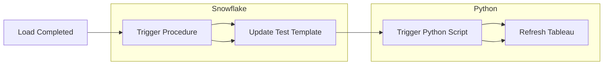

# Automate Trigger with Testing

## Project Overview

This project is designed to automate the process of running SQL test cases, storing the test results, and using the results to trigger further actions. It focuses on integrating SQL and Python to streamline the process, providing outputs that trigger a Tableau subscription for visualization. The pipeline includes query execution, result analysis, and the storage of historical data for deeper insights.

## Objectives

- Automate daily testing of SQL queries.
- Store the test results for long-term analysis.
- Trigger Tableau updates based on test results using Python.

## Table Details

1. **SQL Query Table**
   - Stores test case SQL queries.
   - The table is utilized by a procedure to generate the test output.

2. **Test Template**
   - A table that contains a fixed number of columns and rows, used as a template.
   - The table is populated with results based on the current date.
   - Python triggers Tableau subscription updates using the template data.

3. **History Table**
   - Stores daily test results.
   - Data from this table is used to perform monthly analysis.

## Workflow Steps

1. SQL queries are stored in the SQL query table.
2. Upon completion of data load, a procedure is triggered.
3. The procedure updates the test template with current output.
4. Python code is executed to trigger Tableau subscription updates.
5. Test results are stored in the history table for future analysis.

## Flow Diagram

The process flow is outlined below:



## Technology Stack

- **SQL**: For running test queries and handling database operations.
- **Python**: For automation and triggering Tableau subscriptions.
- **Snowflake**: Data warehousing and procedure execution.
- **Tableau**: For visualizing test results.

## Setup Instructions

1. Clone the repository:
    ```bash
    git clone https://github.com/Satyam20091998/Automate-pipeline.git
    ```
2. Follow the instructions in the `requirements.txt` file to install dependencies.
3. Configure Snowflake and Tableau connections.
4. Set up the necessary SQL tables as outlined in the project documentation.

## Future Enhancements

- Automate analysis of test result trends over different time periods.
- Expand support for different types of test cases.
- Add more advanced error handling and notification features.

## License

This project is licensed under the MIT License - see the [LICENSE](LICENSE) file for details.


